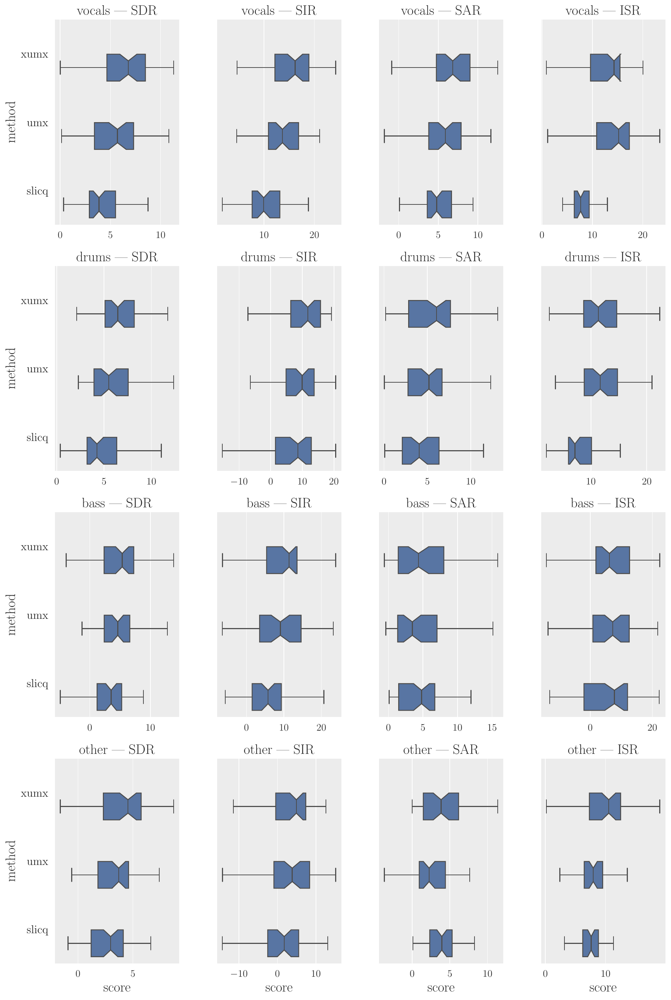
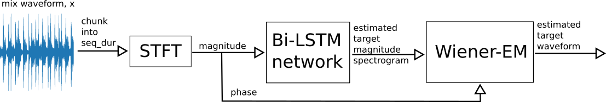
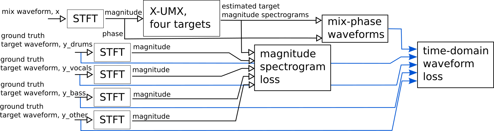
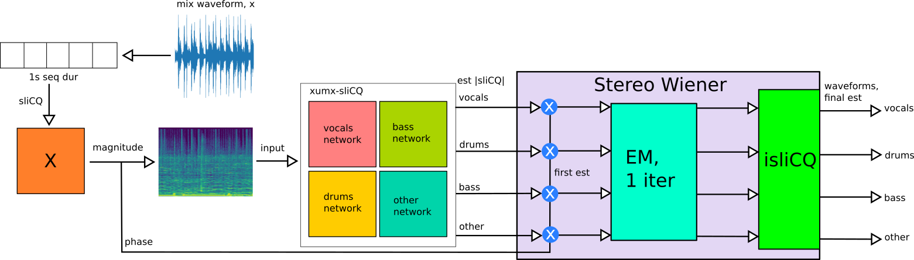
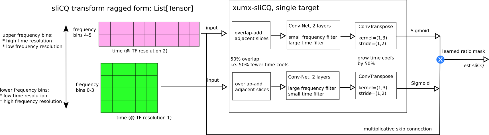
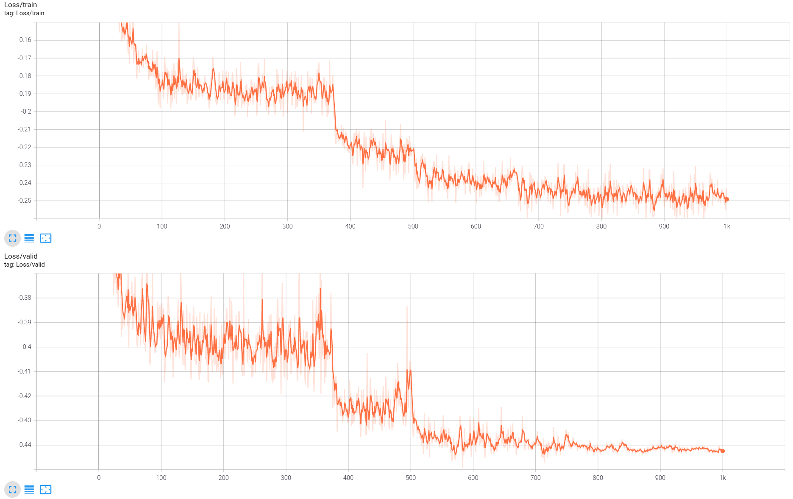

# xumx-sliCQ

My variant of the [Open-Unmix](https://github.com/sigsep/open-unmix-pytorch) (aka UMX) template for music source separation ([Stöter, Uhlich, Liutkus, Mitsufuji 2019](https://hal.inria.fr/hal-02293689/document)). This is a music source separation (or demixing) system which, given a mixed song input, estimates 4 target sources (drums, bass, vocals, other), as defined by [MUSDB18-HQ](https://zenodo.org/record/3338373) dataset. It differs from open-unmix-pytorch in the following ways:
* The spectral transform is the [sliCQ transform](https://github.com/sevagh/nsgt) ([Balazs et al. 2011](http://ltfat.org/notes/ltfatnote018.pdf) and [Holighaus et al. 2012](https://arxiv.org/abs/1210.0084)) instead of the short-time Fourier transform (STFT)
* Convolutional architecture (based loosely on [Grais, Zhao, and Plumbley 2019](https://arxiv.org/abs/1910.09266)) instead of the UMX linear encoder + LSTM + decoder
* Single network like [CrossNet-Open-Unmix](https://github.com/sony/ai-research-code/tree/master/x-umx) ([Sawata, Uhlich, Takahashi, Mitsufuji 2020](https://www.ismir2020.net/assets/img/virtual-booth-sonycsl/cUMX_paper.pdf)), aka X-UMX
    * Combination loss (CL) - loss function on different linear combinations of the 4 targets
    * Multi-domain loss (MDL) - frequency-domain loss (MSE) and time-domain loss ([auraloss](https://github.com/csteinmetz1/auraloss) SI-SDR)

It's a working demonstration of the sliCQ transform in a neural network for music demixing (:heavy_check_mark:), but it failed to beat UMX or XUMX (:x:). The provided pretrained model was trained using the standard [MUSDB18-HQ](https://zenodo.org/record/3338373) dataset.

## Motivation

Time-frequency masking is one strategy for music source separation, where the magnitude spectrogram of the mix is multiplied by an estimated target mask ([more background here](https://source-separation.github.io/tutorial/basics/tf_and_masking.html)). Open-Unmix uses the short-time Fourier transform (STFT) for the spectral representation of music, and learns to estimate the magnitude STFT of a target from the mixture. The STFT is useful in audio and music applications, but it has a uniform and fixed time-frequency resolution controlled by the window size, where one size does not fit all ([Simpson 2015](https://arxiv.org/abs/1504.07372), [Kavalerov et al. 2019](https://arxiv.org/abs/1905.03330)).

Transforms with nonuniform frequency spacing, leading to varying time-frequency resolution, can better represent the tonal and transient characteristics of musical signals. [Frequency-warped transforms](http://elvera.nue.tu-berlin.de/typo3/files/1015Burred2006.pdf) such as the [constant-Q transform](https://arrow.tudublin.ie/cgi/viewcontent.cgi?article=1007&context=argart) have been used in music source separation systems to improve over the STFT.

The sliCQ transform, which is the realtime version of the Nonstationary Gabor Transform (NSGT), is a spectral transform that allows for arbitrary nonlinear frequency scales with perfect inversion. The following visual comparison of sliCQ transform (xumx-sliCQ default) vs. STFT (UMX default) of the [LTFAT glockenspiel signal](https://github.com/ltfat/ltfat/blob/master/signals/gspi.wav) demonstrates the improved visual clarity of musical events:


## Results

BSS (blind source separation) scores, originating from [Vincent et al. 2006](https://hal.inria.fr/inria-00544230/document), are a popular objective measure of source separation performance. BSS is used in much of source separation and demixing literature, and [BSSv4](https://github.com/sigsep/sigsep-mus-eval#bsseval-v4) was used in the [SiSec 2018 evaluation campaign](https://arxiv.org/abs/1804.06267).

The evaluation code (using mostly [SigSep tools](https://github.com/sigsep/)) is stored in the [xumx_slicq_extra](https://gitlab.com/sevagh/xumx_slicq_extra/-/tree/main/mss_evaluation) repo, and the compared systems are:

| Project | Name in boxplot | Paper | Repo | Pretrained model |
|--------------|--------|-------|------|------------------|
| Open-Unmix (UMX) | `umx` | [Stöter, Uhlich, Liutkus, Mitsufuji 2019](https://hal.inria.fr/hal-02293689/document) | https://github.com/sigsep/open-unmix-pytorch | https://zenodo.org/record/3370489 (UMX-HQ) |
| CrossNet-OpenUnmix (X-UMX) | `xumx` | [Sawata, Uhlich, Takahashi, Mitsufuji 2020](https://www.ismir2020.net/assets/img/virtual-booth-sonycsl/cUMX_paper.pdf) | https://github.com/sony/ai-research-code/tree/master/x-umx | https://nnabla.org/pretrained-models/ai-research-code/x-umx/x-umx.h5 |
| xumx-sliCQ | `slicq` | n/a | https://github.com/sevagh/xumx-sliCQ | https://github.com/sevagh/xumx-sliCQ/tree/main/pretrained-model |

The following boxplot (generated like [SiSec 2018](https://github.com/sigsep/sigsep-mus-2018-analysis)) shows the BSSv4 scores of UMXHQ vs. X-UMX vs. xumx-sliCQ (both configurations of Wiener EM) on the 50-track MUSDB18-HQ test set, alongside two oracles (IRM1 and MPI or mixed-phase oracle):



## Citation

My paper on xumx-sliCQ, "Music demixing with the sliCQ transform," was originally published at [MDX21](https://mdx-workshop.github.io) @ ISMIR 2021 ([pdf](https://mdx-workshop.github.io/proceedings/hanssian.pdf))

```
@inproceedings{xumxslicqmdx21,
        title={Music demixing with the sliCQ transform},
        author={Hanssian, Sevag},
        booktitle={MDX21 workshop at ISMIR 2021},
        year={2021}}
```

There is a slightly newer and better version on arXiv, where I also included a definition on music demixing or unmixing as opposed to to music source separation:

>Music source separation is the task of extracting an estimate of one or more isolated sources or instruments (for example, drums or vocals) from musical audio. The task of music demixing or unmixing considers the case where the musical audio is separated into an estimate of all of its constituent sources that can be summed back to the original mixture.

```
@article{xumxslicqarxiv,
        title={Music demixing with the sliCQ transform},
        author={Hanssian, Sevag},
        journal={arXiv preprint arXiv:2112.05509},
        url={https://arxiv.org/abs/2112.05509},
        year={2021}}
```

## Network architecture

The following block diagrams show the evolution of xumx-sliCQ from UMX and X-UMX.

UMX:



X-UMX:



xumx-sliCQ, single target:



The ragged sliCQ is stored in a matrix with zero-padding to support the Wiener EM step directly on the sliCQ transform ([adapting STFT Wiener EM to the sliCQ is discussed here](https://discourse.aicrowd.com/t/umx-iterative-wiener-expectation-maximization-for-non-stft-time-frequency-transforms/6191)). However, the execution time is slower (and native sliCQ Wiener-EM times out in the competition). Therefore, it's controlled by the flag `--slicq-wiener` in the evaluate script. See [docs/wiener_em.md](./docs/wiener_em.md) for more details.

A look into each of the 4 target networks of xumx-sliCQ shows how the convolutional network architecture is applied to the ragged sliCQ transform, where each block contains the frequency bins that share the same time-frequency resolution:



**N.B.** only two blocks are shown for illustrative purposes in the diagram, but the sliCQ used in the model has 262 frequency bins grouped into 70 time-frequency resolution blocks.

Each "Conv-Net" shown above is loosely based on the 2-layer convolutional denoising autoencoder architecture that can be seen in [Grais, Zhao, and Plumbley 2019](https://arxiv.org/abs/1910.09266). The encoder consists of 2x `Conv2d -> BatchNorm2d -> ReLU`, and the decoder consists of 2x `ConvTranspose2d -> BatchNorm2d -> ReLU`. The LSTM model of Open-Unmix did not produce good results in my experiments, and I had better luck with convolutional models.

The same kernel is used in both layers. The time and filter kernel sizes are chosen based on the number of frequency bins and time coefficients inside each block. Dilations are used in the time axis to increase the receptive field while keeping inference time low.

| Frequency bins per block | Frequency kernel size |
|----------------|------------------|
| nb_f < 10 | 1 |
| 10 <= nb_f < 20 | 3 |
| nb_f >= 20 | 5 |

| Time coefficients per block | Time kernel size |
|-----------------------------|------------------|
| nb_t <= 100 | 7, dilation=2 |
| nb_t > 100 | 13, dilation=2 |

The total number of learnable parameters is ~6.7 million:
```
===============================================================================================
Total params: 6,669,912
Trainable params: 6,669,912
Non-trainable params: 0
Total mult-adds (G): 194.27
===============================================================================================
Input size (MB): 28.63
Forward/backward pass size (MB): 9359.33
Params size (MB): 26.68
Estimated Total Size (MB): 9414.64
```

### sliCQ parameter search

The parameters of the sliCQ were chosen by a 60-iteration random parameter search using the "mix-phase oracle", where the ground truth magnitude sliCQ is combined with the mix phase to get a complex sliCQ. The result is inverted to the time domain to get the SDR of the waveform. 60 iterations are enough to give a statistically good combination of parameters in a large problem space according to [Bergstra and Bengio 2012](https://www.jmlr.org/papers/volume13/bergstra12a/bergstra12a.pdf). The parameter search is described in more detail in [docs/slicq_params.md](./docs/slicq_params.md).

The configuration chosen for the xumx-sliCQ network uses the Bark scale with 262 bins, 32.9 - 22050 Hz, and slice and transition lengths of 18060 and 4516 samples (409 ms and 102 ms respectively). For a detailed look at the shape and nature of the sliCQ transform, as well as its noninvertible 50% overlap, look at [docs/slicq_shape.md](./docs/slicq_shape.md).

### Alternative architectures

There is a flag in the training script, `--umx-bilstm`, to use an architecture closer to the original Bi-LSTM of UMX. There is no encoder and decoder layer. The use of the encoder/decoder in the original UMX is to reduce the 2049 frequency bins of the STFT with a window size of 4096 to a more meaningful set of 512 frequency bins, before passing it to the Bi-LSTM. With the sliCQT, there is a much smaller total number of frequency bins, making the encoder/decoder step unnecessary. We pass the frequency bins directly into the Bi-LSTM. This uses a lot of resources and is slower than the CNN architecture, and I never trained it fully. It's just a curiosity.

## Training and inference

The provided [conda yml file](./scripts/environment-gpu-linux-cuda11.yml) should install all the dependencies needed to train and run inference on xumx-sliCQ (using Python 3.9 with the Fedora 34 amd64 OS):

```
sevagh:xumx-sliCQ $ conda env create -f ./scripts/environment-gpu-linux-cuda11.yml
sevagh:xumx-sliCQ $ conda activate xumx-slicq-gpu
(xumx-slicq-gpu) sevagh:xumx-sliCQ $
```

xumx-sliCQ trains for 1000 epochs, like XUMX, with no early stopping patience. The best loss was -0.449, achieved at epoch 583. The [training script](./scripts/train.py) launches a tensorboard process in the background for training monitoring purposes:



The loss applies a mixing coefficient of 0.1 to the time domain SISDR loss, to bring it to a similar order of magnitude of the MSE loss of the sliCQ transform:

```
loss = 0.1*sisdr_loss + mse_loss
```

An epoch takes roughly 5.8 minutes to execute on an RTX 3080 Ti with batch_size=32 and nb_workers=4 (Ryzen 3700x). The same training ideas are used from [open-unmix](https://github.com/sigsep/open-unmix-pytorch/blob/master/docs/training.md):
* chunking with a seq_dur of 1s (the umx default of 6s makes the training prohibitively slow with 15+ minute epochs - on the other hand, >1s durations would have allowed for larger convolution kernels in the time direction)
* random track mixing (same as UMX)
* balanced track sampling (same as UMX)
* gain and channelswap augmentations (same as UMX)

If your GPU has less than 12GB device memory, you probably need to adjust the batch_size downwards to 16 or 8.


The pretrained model is [included in this repository](./pretrained-model). The weights are 28MB on disk (Linux), considerably smaller than umxhq (137MB) and x-umx (136MB). The [training script](./scripts/train.py) defines default arguments which are the same as the arguments used to train the [pretrained model](./pretrained-model) of xumx-sliCQ. As such, to reproduce my results, you need to simply run it (adjusting `--nb-workers` depending on your CPU - 4 is a reasonable value I borrowed from Open-Unmix):

```
$ python scripts/train.py --root=/path/to/musdb18hq --nb-workers=4 --output=/train/dir/
```

## ISMIR 2021 Music Demixing Challenge

I worked on this model for the [ISMIR 2021 Music Demixing Challenge](https://www.aicrowd.com/challenges/music-demixing-challenge-ismir-2021). Out of my 31 submissions, all scored worse than the UMX and XUMX baselines, or timed out and failed to evaluate the hidden data within the specified time limit. The final model stopped being able to run under within competition time limit with the inclusion of Wiener-EM on the sliCQ ([commit dad295f](https://github.com/sevagh/xumx-sliCQ/commit/dad295fe54c3641a49813a29837a2e23445e0918)). In an attempt to speed up CPU inference, I tried a variety of strategies, including faster inference using ONNX, onnxruntime, and Caffe2 (which were slower than PyTorch), and numpy + numba jit in the Wiener EM step (again, slower than PyTorch).

The competition format was a great motivator, and it helped me create and refine xumx-sliCQ. Given the flexibility of the sliCQ transform, this model can be a good starting point for future improvements with different parameter search strategies or neural network architectures.

This published version is actually not the highest scoring xumx/umx-sliCQ variant that I submitted to the competition, but I chose it as my final model because:
* The code for selecting convolution layer parameters is less buggy and better understood than my previous submissions
* The model uses a single configuration of the sliCQ transform for all 4 models (enforced by the combination loss, since we must be able to sum the magnitude sliCQ coefficients for each target)

## History

I have two previous projects where I explored similar ideas:
* [Music-Separation-TF](https://github.com/sevagh/Music-Separation-TF), where I explored the MATLAB Wavelet Toolbox CQT (which is based on the [NSGT](https://www.mathworks.com/help/wavelet/ref/cqt.html)) and other time-frequency resolution ideas in harmonic/percussive/vocal source separation
* [MiXiN](https://github.com/sevagh/MiXiN), an early prototype deep learning model for music source separation based on [Grais and Plumbley 2017](https://arxiv.org/abs/1703.08019)'s Convolutional Denoising Autoencoder architecture, the [reference Python NSGT library](https://github.com/grrrr/nsgt), Keras, and Tensorflow

Even earlier than that, my interest in source separation and demixing began with harmonic/percussive source separation:
* [Real-Time-HPSS](https://github.com/sevagh/Real-Time-HPSS), a realtime adaptation of [Fitzgerald 2010](https://arrow.tudublin.ie/cgi/viewcontent.cgi?article=1078&context=argcon)'s median filtering harmonic/percussive source separation algorithm
* [Zen](https://github.com/sevagh/Zen), a fast CUDA C++ implementation of realtime and offline HPSS

## Extra

Some extra components related to xumx-sliCQ are:
* https://github.com/sevagh/nsgt - nsgt fork and standalone copy of the PyTorch nsgt/sliCQ used in this model
* https://gitlab.com/sevagh/xumx_slicq_extra - evaluation scripts, oracle evaluations, various umx-slicq experimental architectures, latex files, other misc scripts
