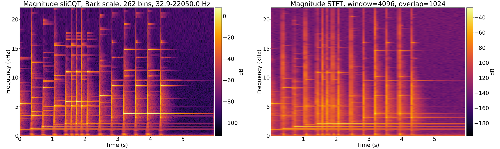
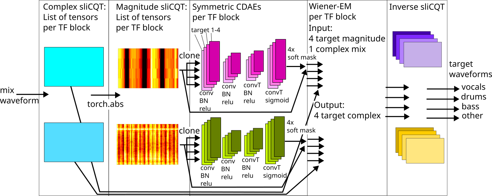
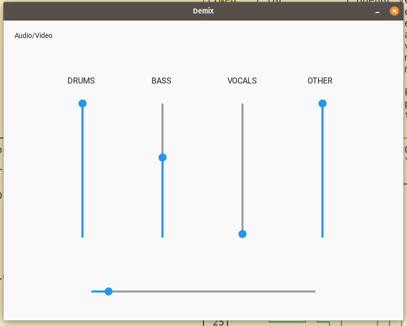
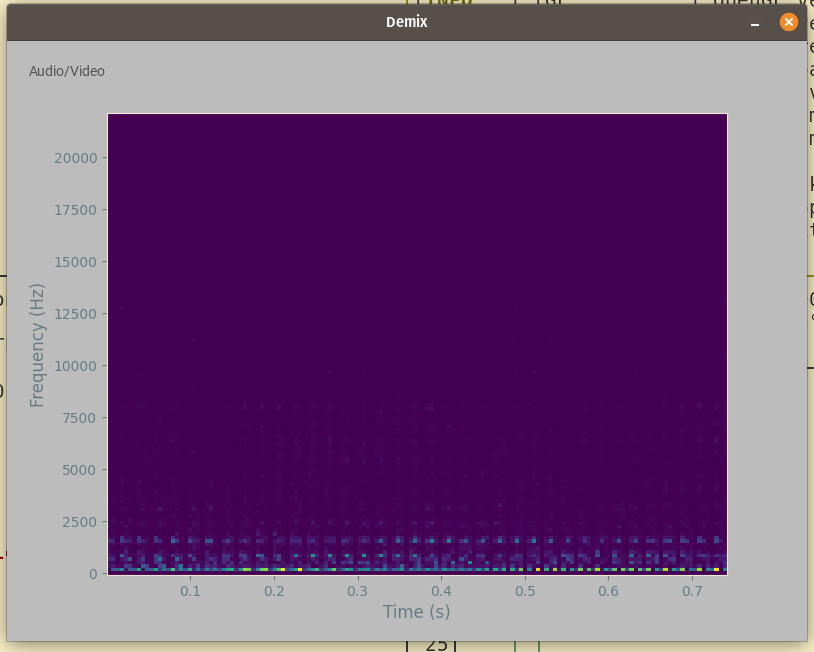
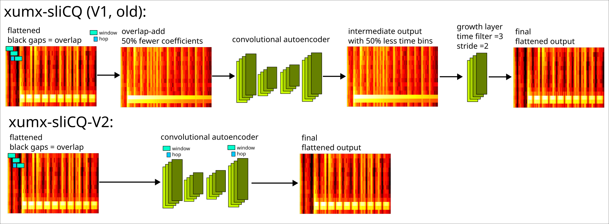

# xumx-sliCQ-V2

[](https://pypi.python.org/pypi/xumx_slicq_v2)
<!--[](https://arxiv.org/abs/2112.05509)-->

xumx-sliCQ-V2 is a PyTorch neural network for music demixing, trained only on [MUSDB18-HQ](https://zenodo.org/record/3338373).

It demixes a musical mixture into stems (vocals/drums/bass/other) by masking the magnitude spectrogram. The code is based on [Open-Unmix (UMX)](https://github.com/sigsep/open-unmix-pytorch) with some key differences:
1. Spectral transform: sliced Constant-Q Transform (sliCQT) with the Bark scale vs. STFT
1. Neural network architecture: convolutional denoising autoencoder (CDAE) vs. dense + Bi-LSTM
1. All targets are trained together with combined loss functions like [CrossNet-Open-Unmix (X-UMX)](https://github.com/sony/ai-research-code/blob/master/x-umx/x-umx.md)

**xumx-sliCQ-V2 scores a total SDR of 4.4 dB with 60 MB\* of pretrained weights for all targets** on the MUSDB18-HQ test set.

**The realtime model scores 4.07 dB and is light and fast!** It takes an average of 2 seconds to demix a song with a GPU and 11 seconds with a CPU using PyTorch.<sup>†</sup> The provided ONNX model optimizes the performance further, taking 7 seconds on the CPU.

Both variants beat the 3.6 dB score of the original [xumx-sliCQ](https://github.com/sevagh/xumx-sliCQ) (28 MB) with the improvements [described here](#improvements-over-xumx-slicq). It also brings the performance closer to the 4.64 dB and 5.54 dB scored by UMX and X-UMX (137 MB) respectively.<sup>‡</sup>

<!--
Cite xumx-sliCQ-V2:
```
(TODO latex citation block here)
write arxiv paper
```-->

Some of the code in this repo is vendored from different external sources: [`xumx_slicq_v2.norbert`](./xumx_slicq_v2/norbert) from <https://github.com/yoyololicon/norbert> and [`cadenza`](./cadenza) from <https://github.com/claritychallenge/clarity/tree/main/recipes/cad1>

<sub>

\*: Pretrained weights for xumx-sliCQ-V2 are stored in this repo with Git LFS: [offline](./pretrained_model), [realtime](./pretrained_model_realtime)

</sub>

<sub>

†: See the [inference section below](#run) for measurements

</sub>

<sub>

‡: UMX and X-UMX were independently re-evaluated as part of xumx-sliCQ: [1](https://github.com/sevagh/xumx_slicq_extra/blob/main/old-latex/mdx-submissions21/paper.md#results), [2](https://github.com/sevagh/xumx_slicq_extra)

</sub>

## Key concepts

Bark-scale sliCQT to better represent musical signals with a nonuniform time-frequency resolution compared to the fixed resolution STFT:



Convolutional network applied to ragged sliCQT (time-frequency blocks with different frame rates):



## Usage

### Prerequisites

You need Python + pip >= 3.8 or Docker. To use your GPU, you need the NVIDIA CUDA Toolkit and an NVIDIA CUDA-capable GPU. For Docker + GPU, you also need the [nvidia-docker 2.0 runtime](https://docs.nvidia.com/datacenter/cloud-native/container-toolkit/install-guide.html#docker). For your own training, tuning, and evaluation, you need the [MUSDB18-HQ dataset](https://zenodo.org/record/3338373).

**Podman support**

Make these changes to use Podman instead of Docker:
* Build command: `buildah bud -t "xumx-slicq-v2" .`
* Run gpu string: `--gpus=all --ipc=host` (compared to `--gpus=all --ipc=host --ulimit memlock=-1 --ulimit stack=67108864` which may result in OCI permission errors around setting ulimits)

### Install

If you want to use Docker (**recommended**), git clone the source code and build the container:
```
$ git clone https://github.com/sevagh/xumx-sliCQ-V2
$ cd ./xumx-sliCQ-V2
$ docker build -t "xumx-slicq-v2" .
```

The container is based on the [NVIDIA PyTorch NGC Container](https://catalog.ngc.nvidia.com/orgs/nvidia/containers/pytorch) to include features and optimizations for to NVIDIA GPUs, such as automatic [TF32 for Ampere+](https://blogs.nvidia.com/blog/2020/05/14/tensorfloat-32-precision-format/), [bfloat16 support for Ampere+](https://docs.nvidia.com/cuda/ampere-tuning-guide/index.html), and more.

To dynamically update the source code in the container while you develop new features, you can volume mount the local checkout of xumx-sliCQ-V2 to `:/xumx-sliCQ-V2`. If not, the container will use a frozen copy of the source code when you built the image.

If you want to use pip, the project is [available on PyPI.org](https://pypi.org/project/xumx-slicq-v2/):
```
# regular case
$ pip install xumx-slicq-v2

# for ONNX CPU inference
$ pip install xumx-slicq-v2[onnxruntime-cpu]

# for ONNX CUDA inference
$ pip install xumx-slicq-v2[onnxruntime-cuda]

# for musdb + museval
$ pip install xumx-slicq-v2[musdb]

# for all development/training dependencies (needs CUDA GPU)
$ pip install xumx-slicq-v2[devel]
```

<details>
<summary>List of all scripts</summary>

| Script | Description | Device |
|:-|:-|:-|
| For end users | |
| xumx_slicq_v2.inference | Demix mixed songs | CPU **or** CUDA GPU |
| For developers | |
| xumx_slicq_v2.evaluation | Evaluate pretrained networks | CPU |
| xumx_slicq_v2.training | Train the network | CUDA GPU |
| xumx_slicq_v2.optuna | Optuna hyperparam tuning | CUDA GPU |
| xumx_slicq_v2.slicqfinder | Random sliCQT param search | CPU **or** CUDA GPU |
| xumx_slicq_v2.visualization | Generate spectrograms | CPU |
| xumx_slicq_v2.export | Export variants for optimized inference (TorchScript, ONNX) | CPU |

If you installed the package with pip, run them like `python -m xumx_slicq_v2.$script_name`.

</details>

### Run

**Pip**: run inference to generate outputs on a folder containing mixed song wav files:
```
$ python -m xumx_slicq_v2 --audio-backend="sox_io" --input-dir=./input/ --output-dir=./output/
Using torch device cpu for backend torch-cpu
Downloading: "https://github.com/sevagh/xumx-sliCQ-V2/raw/main/pretrained_model/xumx_slicq_v2.pth" to /home/sevagh/.cache/torch/hub/checkpoints/xumx_slicq_v2_offline.pth
100%|████████████████████████████████████████████████████████████████████████| 59.6M/59.6M [00:09<00:00, 6.25MB/s]
scale=bark, fbins=262, fmin=32.90, fmax=22050.00, sllen=18060, trlen=4516
song chunks: 100%|██████████████████████████████████████████████████████████████████| 1/1 [00:01<00:00,  1.28s/it]
100%|███████████████████████████████████████████████████████████████████████████████| 1/1 [00:01<00:00,  1.30s/it]
Inference time in s (averaged across tracks): 1.28
```

The appropriate weight files will be automatically downloaded. Runtime options are:
| Arguments | Model | Inference lib | Device |
|:-|:-|:-|:-|
| --runtime-backend=torch-cpu | Offline | PyTorch | CPU |
| --runtime-backend=torch-cuda | Offline | PyTorch | CUDA GPU |
| --runtime-backend=torch-cpu --realtime | Realtime | PyTorch | CPU |
| --runtime-backend=torch-cuda --realtime | Realtime | PyTorch | CUDA GPU |
| --runtime-backend=onnx-cpu | Realtime | ONNXRuntime | CPU |
| --runtime-backend=onnx-cuda | Realtime | ONNXRuntime | CUDA GPU |

**Docker**: run inference to generate outputs on a folder containing mixed song wav files:
```
$ docker run --rm -it \
    -v /path/to/input/songs/:/input \
    -v /path/to/demixed/outputs:/output \
    python -m xumx_slicq_v2.inference --help

#add below lines for gpu support
#--gpus=all --ipc=host --ulimit memlock=-1 --ulimit stack=67108864 \
#python -m xumx_slicq_v2.inference --cuda
```

Inference time for the realtime variant is **2x faster** than the offline model, and **3x faster with ONNX**, measuring the average time taken to demix the 50 MUSDB18-HQ test tracks:
| Model | Device | Inference time (s, avg per track) |
|:-|:-|:-|
| Realtime | GPU | 2.08 |
| Realtime (ONNXRuntime) | CPU | 6.9 |
| Realtime | CPU | 11.35 |
| Offline | CPU | 23.17 |

<details>
<summary>Optimizing inference</summary>

The offline model has to trade off speed and memory usage from the embedded Wiener-EM step, so I only use it for offline CPU inference. The embedded Wiener-EM filtering step from the Norbert library also introduces additional complexity (complex numbers, etc.) for ONNX exporting.

The ONNX optimizations could be taken further with more effort and/or modifying the xumx-sliCQ-V2 code:
* Improving the CUDA performance
* Enhancing CUDA with the TensorRT provider
* Enhancing CPU performance with the OpenVino provider

</details>

<details>
<summary>Training</summary>

```
$ docker run --rm -it \
    --gpus=all --ipc=host --ulimit memlock=-1 --ulimit stack=67108864 \
    -v /path/to/MUSDB18-HQ/dataset:/MUSDB18-HQ \
    -v /path/to/save/trained/model:/model \
    -p 6006:6006 \
    xumx-slicq-v2 \
    python -m xumx_slicq_v2.training --help
```

The Tensorboard training web dashboard is launched by the training script: <http://127.0.0.1:6006/>.

**To persist the model**, you can volume mount a host volume to `:/model` (as in the command above). Killing and relaunching the container with a persisted model will continue the training process. If not, the trained model will disappear when the container is killed.

The lowest lost achieved (complex cross-target MSE + mask sum MSE loss) was 0.0405 at epoch 198. The average epoch time was around 170 seconds, or just under 3 minutes, with a batch size of 64 (and 8 cpu workers for the dataloader).

The lowest lost achieved for the realtime model was 0.0437 at epoch 161. The average epoch time was around 110 seconds, or just under 2 minutes, with a batch size of 64 (and 8 cpu workers for the dataloader).

</details>

<details>
<summary>Hyperparameter tuning</summary>

```
$ docker run --rm -it \
    --gpus=all --ipc=host --ulimit memlock=-1 --ulimit stack=67108864 \
    -v /path/to/MUSDB18-HQ/dataset:/MUSDB18-HQ \
    -p 6006:6006 \
    xumx-slicq-v2 \
    python -m xumx_slicq_v2.optuna --help
```

The Optuna tuning script runs on a cut-down training and validation dataset, and minimizes the SDR score achieved by the model within 10 epochs per trial. It runs for 100 trials and was used to discover improved hyperparameters for xumx-sliCQ-V2 ([read more here](#improvements-over-xumx-slicq)).

The Optuna tuning web dashboard is launched by the tuning script: <http://127.0.0.1:6006/>.

</details>

<details>
<summary>Evaluation</summary>

```
$ docker run --rm -it \
    -v /path/to/MUSDB18-HQ/dataset:/MUSDB18-HQ \
    xumx-slicq-v2 \
    python -m xumx_slicq_v2.evaluation --help
```

By default, the pretrained model will be evaluated. **Pass different models to evaluate** as a path inside the container relative to the source code dir:
```
$ docker run --rm -it \
    -v /path/to/MUSDB18-HQ/dataset:/MUSDB18-HQ \
    -v /path/to/xumx-sliCQ-V2/source/code:/xumx-sliCQ-V2/ \
    xumx-slicq-v2 \
    python -m xumx_slicq_v2.evaluation \
    --model-path='/xumx-sliCQ-V2/model-to-evaluate'
```

This takes ~2-3 hours to run on all 50 test tracks of MUSDB18-HQ on my CPU (5950X + 64GB RAM). It will output the BSS scores of each track, and at the end, output the median score across all frames and tracks:
```
loading separator
scale=bark, fbins=262, fmin=32.90, fmax=22050.00, sllen=18060, trlen=4516
  0%|                                                                              | 0/50 [00:00<?, ?it/s]track: AM Contra - Heart Peripheral
getting audio
applying separation
n chunks: 4
...
<output truncated>
...
vocals          ==> SDR:   4.791  SIR:   7.794  ISR:   8.579  SAR:   4.500
drums           ==> SDR:   4.846  SIR:   8.062  ISR:   8.649  SAR:   4.953
bass            ==> SDR:   4.690  SIR:   8.778  ISR:   5.558  SAR:   4.193
other           ==> SDR:   3.273  SIR:   2.532  ISR:   8.065  SAR:   4.422
```
To get the total SDR, simply sum the four target SDRs and divide by 4:
```
SDR_tot = (SDR_vocals + SDR_drums + SDR_bass + SDR_other)/4.0
```

</details>

<details>

<summary>Cadenza challenge inference + evaluation</summary>

Code related to the Cadenza challenge is stored in the `./cadenza` package:
```
$ docker run --rm -it \
    -v /path/to/MUSDB18-HQ/dataset/:/MUSDB18-HQ \
    -v /path/to/cadenza/challenge/data/:/CADENZA \
    -v /path/to/store/cadenza/results/:/exp \
    xumx-slicq-v2 python -m cadenza.enhance
```

Inference for the Cadenza Challenge task 1 (cad1) uses [adapted baseline code from the recipe](https://github.com/claritychallenge/clarity/tree/main/recipes/cad1/task1/baseline), as well as custom data downloaded as part of the challenge.

The baseline uses Demucs to perform VDBO separation before further processing; I simply replaced Demucs with xumx-sliCQ-V2 in enhance.py.

</details>

### DemixUI

There's a toy UI I implemented using Kivy and asyncio. Install:
```
sevagh@pop-os:~/repos/xumx-sliCQ-V2$ pip install -e .[devel,demixui]
...

# kivy garden is weird, you need additional steps to install the matplotlib garden
sevagh@pop-os:~/repos/xumx-sliCQ-V2$ chmod +x /home/sevagh/mambaforge/envs/xumx_v2/bin/garden
sevagh@pop-os:~/repos/xumx-sliCQ-V2$ garden install matplotlib
```

The choice of asyncio is... questionable. The latency of the music demixing determines the latency of the user interface. The UI state is only updated after each segment is demixed. The user can control the levels of vocals/drums/bass/other via slides, and also toggle to a spectrogram view of the output audio:
```
sevagh@pop-os:~/repos/xumx-sliCQ-V2$ python -m xumx_slicq_v2.demixui --input-file=./masochist.wav
`rk, fbins=262, fmin=32.90, fmax=22050.00, sllen=18060, trlen=4516
ONNXRuntime chosen provider: ['CPUExecutionProvider']
[INFO   ] [Logger      ] Record log in /home/sevagh/.kivy/logs/kivy_23-04-04_31.txt
[INFO   ] [Kivy        ] v2.1.0
[INFO   ] [Kivy        ] Installed at "/home/sevagh/mambaforge/envs/xumx_v2/lib/python3.10/site-packages/kivy/__init__.py"
...
```
<br>



## Theory

### Motivation

The sliced Constant-Q Transform (sliCQT) is a realtime implementation of the Nonstationary Gabor Transform (NSGT), which is a generalized nonuniform time-frequency transform with perfect inverse. Nonuniform time-frequency transforms are better suited to representing sounds with time-varying frequencies, such as music and speech. The STFT is limited due to its use of fixed windows and the time-frequency uncertainty principle of Gabor.

The NSGT can be used to implement a Constant-Q Transform (logarithmic scale), but it can use any type of frequency scale. In xumx-sliCQ and xumx-sliCQ-V2, the same Bark scale is used (262 Bark frequency bins from 32.9-22050 Hz).

<details>
<summary>Past work</summary>

In 2021, I worked on xumx-sliCQ (V1), [the first variant](https://github.com/sevagh/xumx-sliCQ), to submit to the MDX 21 ([Music Demixing Challenge 2021](https://www.aicrowd.com/challenges/music-demixing-challenge-ismir-2021) on AICrowd), and got my paper published to [the MDX 21 workshop](https://mdx-workshop.github.io/proceedings/hanssian.pdf) at ISMIR 2021 (and [arXiv](https://arxiv.org/abs/2112.05509)). The time-frequency uncertainty principle aligned with my desired thesis topic at the Music Technology Master's program at McGill.

In 2023, I chose to revisit the code of xumx-sliCQ for submission to the [First Cadenza Challenge (CAD1)](http://cadenzachallenge.org/), which is a music demixing challenge with the additional context of hearing loss and accessibility. Nonuniform time-frequency transforms, like the sliCQT, are related to the nolinear human auditory system, and I had specific auditory motivations for choosing the Bark scale for the sliCQT in xumx-sliCQ.

</details>

### Improvements over xumx-sliCQ

<details>
<summary>Performance tuning</summary>

First, I improved a lot of sloppy non-neural network code. The embedded [nsgt library](./xumx_slicq_v2/nsgt), which provides the sliCQT (and originates from <https://github.com/sevagh/nsgt>, and before that, the source <https://github.com/grrrr/nsgt>), had a lot of calls to NumPy after my initial conversion to PyTorch, leading to unnecessary host-device communication throughout an epoch trained on my GPU.

Next, I focused on making my epochs faster. The faster I can train it, the more I can work on xumx-sliCQ-V2 within a given time frame. To get the most out of the PyTorch code and my NVIDIA Ampere GPU (3090), I used two resources:
* Using the NVIDIA PyTorch Docker container (`nvcr.io/nvidia/pytorch:22.12-py3`) as the base for my training container to take advantage of implicit speedups provided by NVIDIA (e.g. automatically-enabled [TF32](https://blogs.nvidia.com/blog/2020/05/14/tensorfloat-32-precision-format/_))
* Modifying my PyTorch code according to the [performance tuning guide](https://pytorch.org/tutorials/recipes/recipes/tuning_guide.html)

The code changes were the following:
* In the model code:
    1. `bias=False` for every conv layer that was followed by a batch norm:
        ```
        encoder.extend([
            Conv2d(
                hidden_size_1,
                hidden_size_2,
                (freq_filter, time_filter_2),
                bias=False,
            ),
            BatchNorm2d(hidden_size_2),
            ReLU(),
        ])
        ```
* In the training code:
    1. Set the model `.to(memory_format=torch.channels_last)`
    1. Enable cuDNN benchmarking
        ```
        torch.backends.cudnn.benchmark = True
        ```
    1. Forcing some additional more TF32-related settings:
        ```
        torch.backends.cudnn.allow_tf32 = True
        ```
    1. Using AMP (Automatic Mixed Precision) with bfloat16 (on CUDA and CPU) (greatly reduces memory during training, allowing a larger batch size):
        ```
        with torch.autocast("cuda", dtype=torch.bfloat16),
                torch.autocast("cpu", dtype=torch.bfloat16):
        ```

An epoch takes ~170s (train + validation) on my RTX 3090 with 24GB of GPU memory with `--batch-size=64 --nb-workers=8`. xumx-sliCQ by contrast took 350s per epoch with a batch size of 32 on an RTX 3080 Ti (which had 12GB GPU memory, half of my 3090). However, the old code used PyTorch 1.10, so the upgrade of V2 to 1.13 may also be contributing to improved performance.

</details>

<details>
<summary>Using the full frequency bandwidth</summary>

In xumx-sliCQ, I didn't use frequency bins above 16,000 Hz in the neural network; the demixing was only done on the frequency bins lower than that limit, copying the `umx` pretrained model of UMX. UMX's other pretrained model, `umxhq`, uses the full spectral bandwidth. In xumx-sliCQ-V2, I removed the bandwidth parameter to pass all the frequency bins of the sliCQT through the neural network.

</details>

<details>
<summary>Removing dilations from the convolution layers</summary>

In the CDAE of xumx-sliCQ, I used a dilation of 2 in the time axis to arbitrarily increase the receptive field without paying attention to music demixing quality (because dilations sound cool).

In xumx-sliCQ-V2, I didn't use any dilations since I had no reason to.

</details>

<details>
<summary>Removing the inverse sliCQT and time-domain SDR loss</summary>

In xumx-sliCQ, I applied the mixed-domain SDR and MSE loss of X-UMX. However, due to the large computational graph introduced by the inverse sliCQT operation, I was disabling its gradient:
```
X = slicqt(x)
Xmag = torch.abs(X)
Ymag_est = unmix(Xmag)
Ycomplex_est = mix_phase(torch.angle(X), Ymag_est)

with torch.no_grad():
     y_est = islicqt(Ycomplex_est)
```

Without this, the epoch time goes from 1-5 minutes to 25+ minutes, making training unfeasible. However, by disabling the gradient, the SDR loss can't influence the network performance. In practice, I found that the MSE was an acceptable correlate to SDR performance, and dropped the isliCQT and SDR loss calculation.

</details>

<details>
<summary>Replacing the overlap-add with pure convolutional layers</summary>

A quirk of the sliCQT is that rather than the familiar 2 dimensions of time and frequency, it has 3 dimensions: slice, time-per-slice, and frequency. Adjacent slices have a 50% overlap with one another and must be summed to get the true spectrogram in a destructive operation (50% of the time coefficients are lost, with no inverse).

In xumx-sliCQ, an extra transpose convolutional layer with stride 2 is used to grow the time coefficients back to the original size after the 4-layer CDAE, to undo the destruction of the overlap-add.

In xumx-sliCQ-V2, the first convolutional layer takes the overlap into account by setting the kernel and stride to the window and hop size of the destructive overlap-add. The result is that the input is downsampled in a way that is recovered by the final transpose convolution layer in the 4-layer CDAE, eliminating the need for an extra upsampling layer.

Diagram (shown for one time-frequency block):


By this point, I had a model that scored **4.1 dB** with 28 MB of weights using magnitude MSE loss.

</details>

<details>
<summary>Differentiable Wiener-EM and complex MSE</summary>

Borrowing from [Danna-Sep](https://github.com/yoyololicon/danna-sep), one of the [top performers in the MDX 21 challenge](https://github.com/yoyololicon/music-demixing-challenge-ismir-2021-entry), the differentiable Wiener-EM step is used inside the neural network during training, such that the output of xumx-sliCQ-V2 is a complex sliCQT, and the complex MSE loss function is used instead of the magnitude MSE loss. Wiener-EM is applied separately in each frequency block as shown in the [architecture diagram at the top of the README](#key-concepts).

This got the score to **4.24 dB** with 28 MB of weights trained with complex MSE loss (0.0395).

In xumx-sliCQ, Wiener-EM was only applied in the STFT domain as a post-processing step. The network was trained using magnitude MSE loss. The waveform estimate of xumx-sliCQ combined the estimate of the target magnitude with the phase of the mix (noisy phase or mix phase).

</details>

<details>
<summary>Discovering hyperparameters with Optuna</summary>

Using the included [Optuna tuning script](./xumx_slicq_v2/optuna.py), new hyperparameters that gave the highest SDR after cut-down training/validation epochs were:
* Changing the hidden sizes (channels) of the 2-layer CDAE from 25,55 to 50,51 (increased the model size from ~28-30MB to 60MB)
* Changing the size of the time filter in the 2nd layer from 3 to 4

Note that:
* The time kernel and stride of the first layer uses the window and hop size related to the overlap-add procedure, so it's not a tunable hyperparameter
* The ragged nature of the sliCQT makes it tricky to modify frequency kernel sizes (since the time-frequency bins can vary in their frequency bins, from 1 single frequency up to 86), so I kept those fixed from xumx-sliCQ
* The sliCQT params could be considered a hyperparameter, but the shape of the sliCQT modifies the network architecture, so for simplicity I kept it the same as xumx-sliCQ (262 bins, Bark scale, 32.9-22050 Hz)

This got the score to **4.35 dB** with 60 MB of weights trained with complex MSE loss of 0.0390.

</details>

<details>
<summary>Mask sum MSE loss</summary>

In spectrogram masking approaches to music demixing, commonly a ReLU or Sigmoid activation function is applied as the final activation layer to produce a non-negative mask for the mix magnitude spectrogram. In xumx-sliCQ, I used a Sigmoid activation in the final layer (UMX uses a ReLU). The final mask is multiplied with the input mixture:
```
mix = x.clone()

# x is a mask
x = cdae(x)

# apply the mask, i.e. multiplicative skip connection
x = x*mix
```

Since the mask for each target is between [0, 1], and the targets must add up to the mix, then the masks must add up to exactly 1:
```
drum_mask*mix + vocals_mask*mix + other_mask*mix + bass_mask*mix = mix
drum_mask + vocals_mask + other_mask + bass_mask = 1.0
```

In xumx-sliCQ-V2, I added a second loss term called the mask sum loss, which is the MSE between the sum of the four target masks and a matrix of 1s. This needs a small code change where both the complex slicqt (after Wiener-EM) and the sigmoid masks are returned in the training loop.

This got the score to **4.4 dB** with 60 MB of weights trained with complex MSE loss + mask sum loss of 0.0405.

</details>

<details>
<summary>Realtime variant</summary>

For a future realtime demixing project, I decided to create a realtime variant of xumx-sliCQ-V2. To support realtime inputs:
* I added left padding of the first convolution layer, such that the intermediate representations throughout the autoencoder are only derived from causal inputs
* I replaced the resource-intensive Wiener-EM target maximization with the naive mix-phase approach, which is computationally much lighter (simply combine the target magnitude slicqt with the phase of the mix)

</details>
