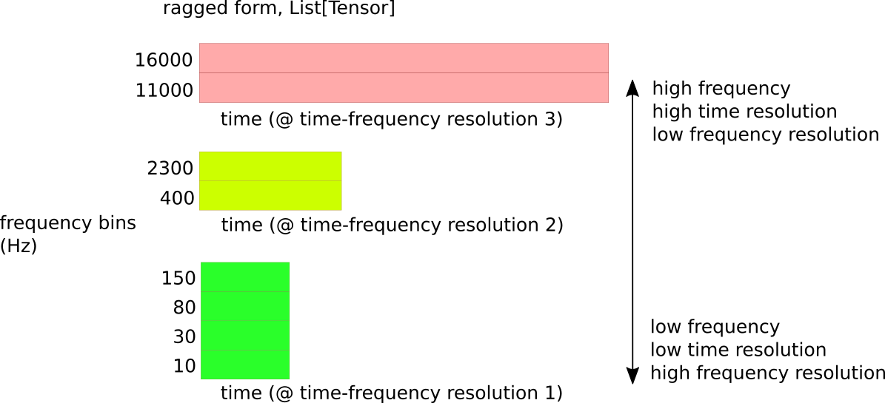

### The ragged sliCQ transform

The output of the ragged (or jagged) sliCQ transform of an audio waveform is a list of tensors representing blocks of frequency bins grouped by their time resolution:



This code block shows the shape and dtype of the sliCQ transform:

```
(nsgt-pytorch) sevagh:nsgt $ python examples/ragged_vs_matrix.py ./mestis.wav --scale bark --bins 262 --fmin 32.9 --fmax 22050 --sllen 18060 --trlen 4516
NSGT-sliCQ jagged shape:
        block 0, f 0: torch.Size([52, 2, 1, 28])
        block 1, f 1: torch.Size([52, 2, 86, 16])
        block 2, f 87: torch.Size([52, 2, 14, 20])
        block 3, f 101: torch.Size([52, 2, 11, 24])
        block 4, f 112: torch.Size([52, 2, 9, 28])
        block 5, f 121: torch.Size([52, 2, 8, 32])
        block 6, f 129: torch.Size([52, 2, 7, 36])
        block 7, f 136: torch.Size([52, 2, 6, 40])
        block 8, f 142: torch.Size([52, 2, 6, 44])
        block 9, f 148: torch.Size([52, 2, 5, 48])
        block 10, f 153: torch.Size([52, 2, 5, 52])
        block 11, f 158: torch.Size([52, 2, 4, 56])
        block 12, f 162: torch.Size([52, 2, 5, 60])
        block 13, f 167: torch.Size([52, 2, 3, 64])
        block 14, f 170: torch.Size([52, 2, 4, 68])
        block 15, f 174: torch.Size([52, 2, 4, 72])
        block 16, f 178: torch.Size([52, 2, 3, 76])
        block 17, f 181: torch.Size([52, 2, 3, 80])
        block 18, f 184: torch.Size([52, 2, 3, 84])
        block 19, f 187: torch.Size([52, 2, 3, 88])
        block 20, f 190: torch.Size([52, 2, 2, 92])
        block 21, f 192: torch.Size([52, 2, 3, 96])
        block 22, f 195: torch.Size([52, 2, 2, 100])
        block 23, f 197: torch.Size([52, 2, 3, 104])
        block 24, f 200: torch.Size([52, 2, 2, 108])
        block 25, f 202: torch.Size([52, 2, 2, 112])
        block 26, f 204: torch.Size([52, 2, 2, 116])
        block 27, f 206: torch.Size([52, 2, 2, 120])
        block 28, f 208: torch.Size([52, 2, 2, 124])
        block 29, f 210: torch.Size([52, 2, 2, 128])
        block 30, f 212: torch.Size([52, 2, 2, 132])
        block 31, f 214: torch.Size([52, 2, 2, 136])
        block 32, f 216: torch.Size([52, 2, 2, 140])
        block 33, f 218: torch.Size([52, 2, 1, 144])
        block 34, f 219: torch.Size([52, 2, 2, 148])
        block 35, f 221: torch.Size([52, 2, 2, 152])
        block 36, f 223: torch.Size([52, 2, 1, 156])
        block 37, f 224: torch.Size([52, 2, 2, 160])
        block 38, f 226: torch.Size([52, 2, 1, 164])
        block 39, f 227: torch.Size([52, 2, 2, 168])
        block 40, f 229: torch.Size([52, 2, 1, 172])
        block 41, f 230: torch.Size([52, 2, 2, 176])
        block 42, f 232: torch.Size([52, 2, 1, 180])
        block 43, f 233: torch.Size([52, 2, 1, 184])
        block 44, f 234: torch.Size([52, 2, 2, 188])
        block 45, f 236: torch.Size([52, 2, 1, 192])
        block 46, f 237: torch.Size([52, 2, 1, 196])
        block 47, f 238: torch.Size([52, 2, 1, 200])
        block 48, f 239: torch.Size([52, 2, 2, 204])
        block 49, f 241: torch.Size([52, 2, 1, 208])
        block 50, f 242: torch.Size([52, 2, 1, 212])
        block 51, f 243: torch.Size([52, 2, 1, 216])
        block 52, f 244: torch.Size([52, 2, 1, 220])
        block 53, f 245: torch.Size([52, 2, 1, 224])
        block 54, f 246: torch.Size([52, 2, 1, 228])
        block 55, f 247: torch.Size([52, 2, 2, 232])
        block 56, f 249: torch.Size([52, 2, 1, 236])
        block 57, f 250: torch.Size([52, 2, 1, 240])
        block 58, f 251: torch.Size([52, 2, 1, 244])
        block 59, f 252: torch.Size([52, 2, 1, 248])
        block 60, f 253: torch.Size([52, 2, 1, 252])
        block 61, f 254: torch.Size([52, 2, 1, 256])
        block 62, f 255: torch.Size([52, 2, 1, 264])
        block 63, f 256: torch.Size([52, 2, 1, 268])
        block 64, f 257: torch.Size([52, 2, 1, 272])
        block 65, f 258: torch.Size([52, 2, 1, 276])
        block 66, f 259: torch.Size([52, 2, 1, 280])
        block 67, f 260: torch.Size([52, 2, 1, 284])
        block 68, f 261: torch.Size([52, 2, 1, 288])
        block 69, f 262: torch.Size([52, 2, 1, 292])
recon error (mse): 2.9413204270329002e-15
```

The dtype is complex64, and the shape above is:
```
nb_slices, nb_channels, nb_f_bins, nb_t_bins = block.shape
```

This needs a non-invertible 50% overlap on adjacent slices (also reported by the [Essentia devs](https://mtg.github.io/essentia-labs/news/2019/02/07/invertible-constant-q/) in their implementation of the sliCQ). The overlap is necessary to create a spectrogram and, as I discovered, the neural network learns best from the overlapped version as well.

The script above is from my standalone [sliCQ repo](https://github.com/sevagh/sliCQ-pytorch).
